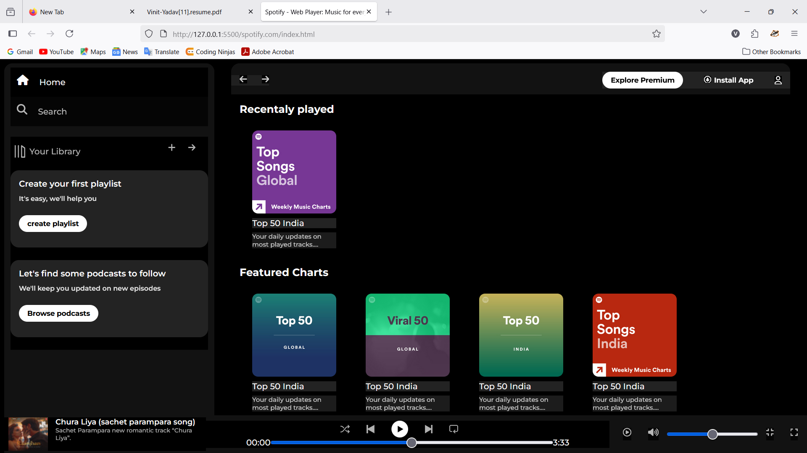

# 🎵 Spotify Clone – Web Player

A front-end clone of the Spotify Web Player built using **HTML**, **CSS**, and **Font Awesome** for icons.  
This project replicates the modern Spotify interface, including sidebar navigation, playlist cards, and a music player UI.

---

## 🚀 Features

- **Sidebar Navigation** – Home, Search, and Library options.
- **Playlist & Podcast Cards** – Display of different music categories with images and descriptions.
- **Sticky Top Navigation** – Explore Premium, Install App, and User icon.
- **Music Player Controls** – Play, pause, skip, volume control, and progress bar.
- **Responsive Design** – Optimized for different screen sizes using CSS.
- **Custom Fonts & Icons** – Google Fonts (Montserrat) and Font Awesome integration.

---

## 📂 Project Structure

📁 spotify-clone
│── 📁 assets # Images & icons used in the project
│── 📄 index.html # Main HTML structure
│── 📄 style.css # Styling for the project
└── 📄 README.md # Project documentation

---

## 🛠️ Technologies Used

- **HTML5** – Structure of the web page.
- **CSS3** – Styling and layout.
- **Font Awesome** – Icons for navigation and controls.
- **Google Fonts** – Montserrat font for modern typography.

---

## 📸 Screenshots

### Home Page

---

## 📦 Installation & Usage

1. **Clone the repository**
   ```bash
   git clone https://github.com/your-username/spotify-clone.git
   ```
---   
### Navigate to the project folder

bash->
Copy->
Edit->
cd spotify-clone->
Open in Browser->

Double-click index.html
or

Run with a local server (VS Code Live Server extension recommended).

---
# 🔮 Future Improvements
- Add real music playback using **JavaScript** and **Audio API**.

- Fetch playlists dynamically from **Spotify Web API**.

- Implement user authentication for personalized playlists.

# 📜License
This project is for educational purposes only and is not affiliated with Spotify.
Feel free to use and modify for your learning.